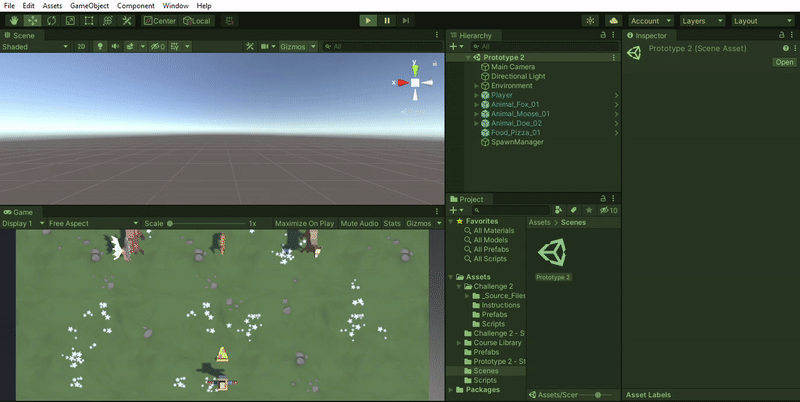
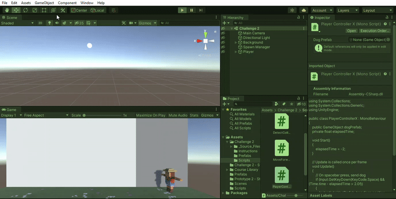

# Prototype-2

This repository is a game development project using Unity editor and C# programming language, concepts explored in this project include:

- Prefabs
- Box Colliders
- Rigid Body
- C# methods such as _Instantiate_, _InvokeRepeating_, _Random.Range_, _Destroy_  

## Demonstration

There are two gaming scenes in this project:

- Feed The Animals

- Play Fetch Challenge

## Usage

- Copy the repo link and clone the repo into your local machine.
- Locate the __Assets__ directory.
- For the Feed The Animals, Locate the __scenes__ directory, and open the __Prototype 2__ unity file. All scripts are located in the __Scripts__ directory.
- For Play Fetch, locate the __Challenge 2__ directory inside the Assets directory, the open the __Challenge 2__ unity file. All Scripts are loacted in the scripts directory inside challenge 2.
